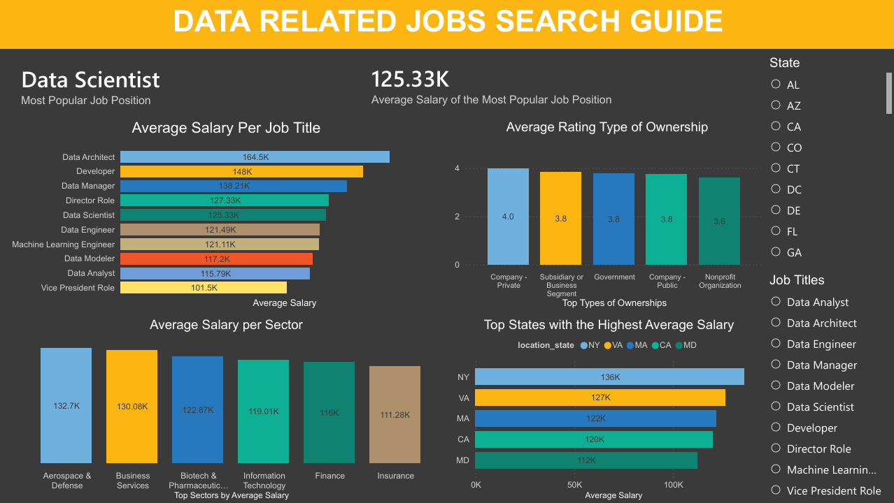
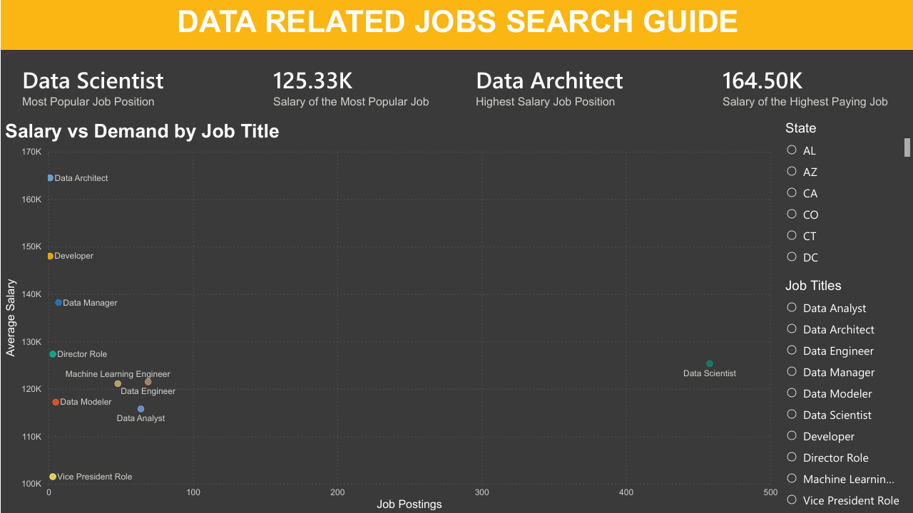
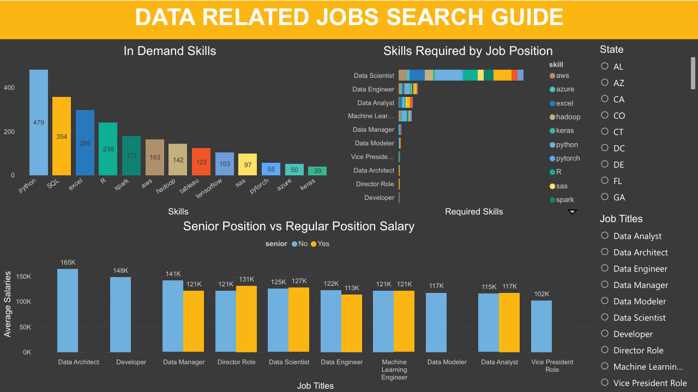

# 📊 Data Science Jobs Analysis — SQL & Power BI
### Tools Used: MySQL · Power Query · Power BI Desktop

---

## 📋 Project Overview

An end-to-end data analysis project using a real-world Glassdoor dataset of data science job postings across the United States. The dataset was intentionally complex and required significant restructuring to simulate a realistic data engineering and analytics scenario. The project covers the full pipeline — from importing raw unformatted data, through intensive SQL programmatic cleaning and exploratory data analysis (EDA), to a multi-page interactive Power BI dashboard.

**Dataset Source:** [Data Science Job Posting on Glassdoor – Kaggle](https://www.kaggle.com/datasets/rashikrahmanpritom/data-science-job-posting-on-glassdoor)

---

## 🔑 Key Findings

- **Most In-Demand Role:** Data Scientist dominated the listings with 458 distinct postings.
- **Highest Compensated Role:** Data Architect commanded the highest compensation with an average salary of $164,500.
- **Lowest Compensated Role:** Vice President positions recorded the lowest entry average at $101,500 within this specific distribution.
- **Top Hiring Enterprise:** Maxar Technologies led active recruitment with 12 job openings.
- **Geographic Hotspots:** San Francisco, CA emerged as the top employment city (58 postings), while California took the lead at the state level with 155 postings.
- **Premium Salary States:** New York yielded the highest average salary ($136,000), closely followed by Virginia ($127,000).
- **Highest Paying Industry Sector:** Aerospace & Defense topped the list ($132,700 average salary across 46 openings).
- **Highest Volume Industry Sector:** Information Technology recorded the highest market demand by job count.
- **Optimal Company Structure:** Private Companies provided the best baseline balance of workplace culture and compensation, averaging a 4.0/5.0 Glassdoor rating and a $121,868 average salary.
- **Core Technology Stack:** Python, SQL, and Excel emerged as the top three most globally demanded technical skills.
- **Seniority Paradox:** Senior titles do not consistently guarantee higher compensation; certain roles (e.g., Director and Data Scientist positions) tracked slightly higher salary midpoints for non-senior variants.
- **Hiring Out-of-State Premium:** Job postings looking to recruit candidates outside of the company’s home headquarters state pay an average premium of ~$10,207 more than matching same-state listings.
- **Corporate Scale Inconsequential:** Structural parameters like company size, revenue scale, type of ownership, and corporate founding year revealed no statistically significant correlation with offered salary rates.

---

## 🛠️ Project Steps

### 1. Data Cleaning (MySQL)
* **Staging Strategy:** Formulated a localized staging table (`ds_jobs_staging`) from the raw data `ds_jobs_raw` to maintain historical record backups before building clean production formats.
* **Deduplication Engine:** Leveraged `ROW_NUMBER()` window functions paired with a comprehensive `PARTITION BY` across key descriptive dimensions to target and safely eliminate duplicate rows.
* **Job Title Standardization:** Consolidated chaotic, highly specific text inputs (e.g., *Analytics Manager - Data Mart*) into **10 definitive job profiles** using a structured conditional `CASE` mapping matrix:
  > Data Architect, Director Role, Vice President Role, Data Modeler, Data Manager, Machine Learning Engineer, Data Engineer, Developer, Data Analyst, Data Scientist
* **Salary Parsing Logic:** Deconstructed raw strings like `$137K-$171K (Glassdoor est.)` using nested `SUBSTRING_INDEX()` queries to split and isolate numeric `min_salary_estimate` and `max_salary_estimate` boundaries into integers. Computed a standardized `average_salary` midpoint rounded to 2 decimal points.
* **Text Truncation & Sanitation:** Stripped appended numerical review rankings from raw text company values (e.g., *Healthfirst 3.1*) by implementing conditional `REGEXP` filters alongside `SUBSTRING_INDEX` and text `REPLACE` string manipulations.
* **Geographic Field Splitting:** Broke combined regional metrics (e.g., `San Francisco, CA`) into clean, independent `_city` and `_state` relational columns. Implemented dictionary-style updates to map full written state text names into standard 2-letter abbreviations while mapping unidentifiable lines to `NULL`.
* **Programmatic Skill Extraction:** Engineered 13 logical binary flag columns (`1` = required, `0` = omitted) from free-form text blocks within the raw `job_description` field via wild-card `LIKE` regex matching. Tracked tools include: `python`, `r_skills`, `sql_skills`, `spark`, `hadoop`, `tableau`, `excel`, `aws`, `azure`, `tensorflow`, `keras`, `pytorch`, and `sas`.
* **Feature Engineering:** - `senior`: Conditional flag isolating senior placement markers (`Senior`, `Sr`, `Lead`, `Principal`) directly out of the title string.
  - `same_state`: Logical validation check determining if a job position location aligns with the primary corporate headquarters.
* **Production Table Export:** Constructed the clean final target table `ds_jobs_cleaned` after pruning the raw description columns and outdated unformatted source fragments.

### 2. Exploratory Data Analysis (MySQL)
Investigated 14 distinct data-driven business requirements using structured SQL scripts to extract clear hiring intelligence:
* Quantified market popularity distributions and volume concentrations per role type.
* Computed comparative baseline salary midpoints segmented across job categories, sectors, revenue sizes, ownership models, and historical corporate longevity.
* Evaluated top employment city and state clusters to determine regional geographic hotspots.
* Profiled top hiring corporations alongside compensation ranges mapped against baseline organizational feedback ratings.
* Examined corporate recruitment variances between domestic operations and foreign international groups.
* Cross-referenced financial data splits comparing seniority designations and cross-border out-of-state recruitment premiums.

### 3. Dashboard Design & Visualization (Power BI)
Assembled a multi-page interactive executive intelligence dashboard structured as a *Data Related Jobs Search Guide*:
* **Page 1 — Salary & Demand Overview:** Incorporates horizontal distribution bars tracking average salary baselines per job type, business sector, ownership categories, and top states. Integrates state and job title filter panes.
* **Page 2 — Salary vs. Demand Scatter:** Houses a custom multi-dimensional scatter matrix comparing average compensation (Y-axis) against job posting volumes (X-axis) across individual job titles. Features high-impact summary cards targeting peak roles.
* **Page 3 — Skills & Senior Analysis:** Features an inventory checklist of technical tools mapped via volume frequency bars alongside a detailed cross-tabulation dot matrix heatmap evaluating skill requirements per career focus. Features grouped tracking charts comparing senior vs. non-senior compensation ranges.

---

## 📁 Files in this Repository

| File | Description |
|------|-------------|
| `import_dataset.sql` | MySQL script utilized to safely load and structure raw files into database clusters |
| `data cleaning.sql` | Full MySQL script managing data cleansing, staging setups, data type adjustments, and regex logic |
| `EDA.sql` | Master script tracking the complete suite of analytical exploratory queries used to extract findings |
| `Uncleaned_DS_jobs.csv` | Raw source dataset containing unformatted job postings scraped from Glassdoor |
| `ds_jobs_cleaned.csv` | Cleaned production-ready output file generated after running SQL transformations |
| `DS JOBS DASHBOARD.pbix` | Main Power BI workbook file containing data models, canvas reports, and active visuals |
| `DS JOBS DASHBOARD PREVIEW.pdf` | Dedicated PDF document providing a direct visual snapshot of the analytics layouts |
| `DS_Jobs_Documentation.pdf` | Detailed engineering write-up documenting methodology, architecture, and complete project breakdowns |
| `page1-ds-dashboard.png` | Main interface capture focusing on Salary and Demand Overview analytics |
| `page2-ds-dashboard.png` | Secondary layout capture displaying the Demand Scatter and dynamic filtering matrices |

---

## 📊 Dashboard Preview

---

## 💡 Conclusions & Strategic Recommendations

The data science and analytics employment market across the United States is fundamentally healthy, with a strong demand for Data Scientist profiles and a premium pricing model favoring Data Architect specialists. 

Candidates and recruiters should take note of these actionable insights:
1. **Prioritize the Core Tech Stack:** Aspiring professionals should focus heavily on mastering Python, SQL, and Excel, as these three tools remain the most widely expected baselines across all analytics disciplines.
2. **Target Strategic Sectors:** Job seekers looking for premium compensation should focus their applications on the Aerospace & Defense or Information Technology sectors, while prioritizing private corporations to secure the best balance of higher compensation and positive company ratings.
3. **Expand Geographic Scope:** Job seekers should look beyond their immediate local markets. Because out-of-state roles offer an average salary premium of ~$10,207, applying to remote or cross-state positions provides a higher financial return than targeting same-state headquarters.

> **Note:** This project utilizes a real-world Glassdoor dataset to show proficiency in database scripting, programmatic data manipulation, and building commercial-grade business intelligence solutions.

---

## 👤 Author

**Niel Andrei Balagtas**
- 📧 nielandreibalagtas@gmail.com
- 💼 [LinkedIn](https://www.linkedin.com/in/niel-andrei-balagtas-360442379/)
- 🐙 [GitHub](https://github.com/nielandreibalagtas)

---
